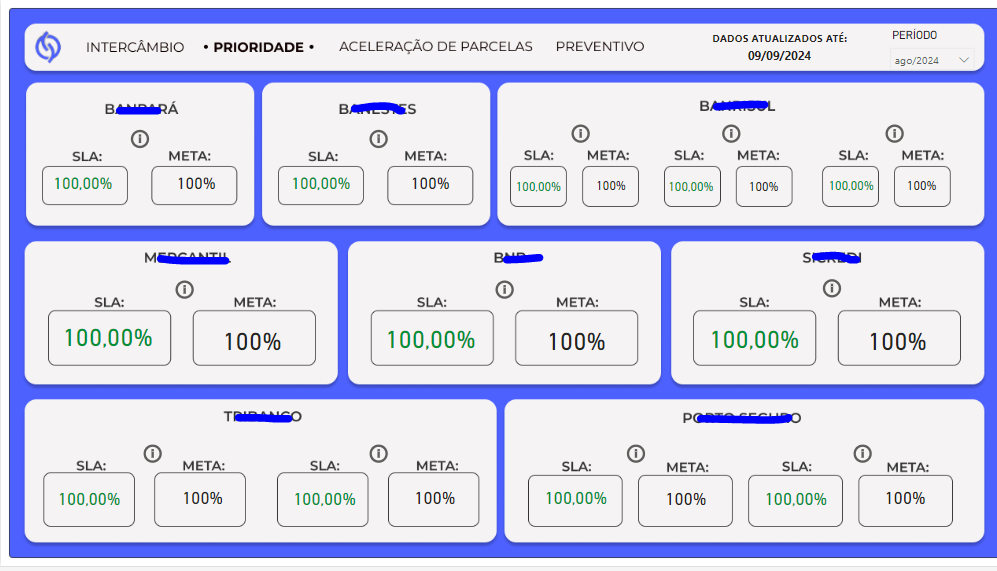
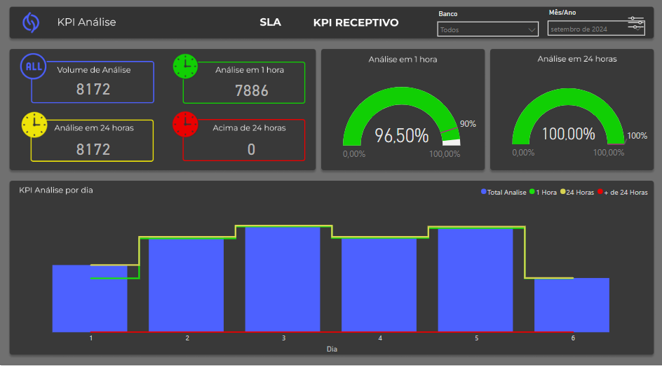

# PROJETO DE EXTENSÃO - BANCO DE DADOS RELACIONAIS 

### William da Silva Oliveira
### 08/2024

## 1. Diagnóstico e Teorização
### 1.1. Descrição das partes envolvidas no projeto.

Atualmente, trabalho na área de prevenção à fraude e intercâmbio. Uma das minhas principais responsabilidades é alimentar os relatórios de MIS com dados gerados pela operação de cartões, que envolve atendentes da área de risco, analistas de chargeback e analistas de suporte aos clientes. Esses profissionais, em conjunto com a coordenação, serão parte integrante do projeto.

A empresa responsável é a CSU Digital (CNPJ: 01.896.779/0001-38), localizada na Rua Piauí, 136, bairro Nova Aldeinha, Barueri/SP. Mais informações estão disponíveis [aqui](https://www2.csu.com.br/).

O projeto tem como objetivo atender a todos os colaboradores das áreas mencionadas.

### 1.2. Situação-problema Identificada
Trabalhamos em três principais áreas: Prevenção à Fraude, Intercâmbio e Suporte Operacional. Um desafio comum a todas essas áreas é a rastreabilidade da produtividade dos funcionários.

Atualmente, toda a produtividade é registrada em planilhas de Excel, o que apresenta um risco significativo de alteração ou perda de dados entre o momento de registro e a compilação dos dados para geração de relatórios, seja para os clientes ou para as áreas internas.

Nesse contexto, lidamos com KPIs e SLAs contratuais, além da responsabilidade individual pelas metas estabelecidas para cada equipe.

O principal problema que pretendo resolver é a governança desses dados.

### 1.3. Demandas sociocomunitárias e motivação acadêmica
Os setores envolvidos enfrentam alguns problemas devido à situação mencionada.

O principal deles está relacionado aos SLAs contratuais que a empresa firma com seus clientes. A maneira atual de gerenciar os dados apresenta riscos significativos, pois um simples erro de digitação pode custar milhares de reais à empresa.

### 1.4. Objetivos a serem alcançados
Tenho três objetivos principais a serem alcançados neste projeto:

    i. Desenvolver um esquema de banco de dados relacional para armazenar os dados e integrá-lo ao front-end do sistema utilizado.

    ii. Desenvolver relatórios automatizados e analíticos para o acompanhamento diário dos SLAs.

    iii. Criar um sistema de acompanhamento, em nível de supervisão, da produtividade dos colaboradores envolvidos.

<br><br>

## 2. Planejamento para o desenvolvimento da atividade

### 2.1. Plano de trabalho com cronograma das atividades

    Ação 1: Desenvolver o esquema do banco de dados;

    Ação 2: Registrar a demanda tratada nas tabelas criadas;

    Ação 3: Criação do relatório de acompanhamento diário de SLAs;

    Ação 4: Criação do relatório de acompanhamento diário de produtividade.

### 2.2. Envolvimento do público participante

    1. Criação do esquema;

    2. Reunião com o DBA da área para criação das tabelas em ambiente de homologação;

    3. Reunião com um dos responsáveis pelo front-end utilizado e criação do procedimento de inserção dos dados do caso tratado;

    4. Reunião com os líderes de cada área para entender quais informações são relevantes na apresentação dos indicadores;

    5. Após o desenvolvimento, uma nova reunião com os líderes das equipes para apresentar o trabalho.

### 2.3. Avaliação dos resultados alcançados
Ferramentas Utilizadas no Projeto:

+ DBeaver: Para modelagem de entidades e relacionamentos.
+ SQL Server: Como sistema gerenciador de banco de dados.
+ Excel: Para análises rápidas e exploração inicial dos dados.
+ Power BI: Para criação de relatórios e dashboards interativos.

Este projeto visa padronizar os métodos atuais de entrada e saída de dados, proporcionando melhorias na performance individual e de grupo. Com a disponibilidade dos dados em tempo real ou quase em tempo real, a tomada de decisões torna-se mais proativa. Isso permitirá a antecipação de possíveis quebras de SLA e outras análises gerenciais.

<br><br>

## Encerramento das atividades

### 3.1. Relato da experiência individual no desenvolvimento da atividade

+ Contextualização: A experiência durante o processo me proporcionou habilidades que não conseguiria adquirir em sala de aula. E acredito que esse seja o propósito do projeto de extensão. O que mais utilizei de ferramenta apresentada pelo curso nesse primeiro semestre foi a modelagem conceitual do banco de dados. Isso nos permitiu criar um ecossistema de dados que, a partir desse ponto inicial, irá se expandir para outras questões que ainda precisam de atenção no nosso dia a dia. 

+ Metodologia: O projeto se baseou em desenhar a solução, depois implementá-la em ambiente de homologação. Para isso, foi necessário agendar algumas reuniões com a equipe de banco de dados (não fui autorizado a divulgar imagens das reuniões). Após implementado em homologação, participei de algumas reuniões com os gerentes e coordenadores das áreas que utilizariam essa nova visualização para capturar as principais necessidades que seriam atendidas através da solução. Em seguida, o novo banco de dados foi inserido no front e pudemos capturar as principais informações. Por último, foram desenvolvidos alguns relatórios que descrevem a produtividade dos setores, assim como o atingimento dos SLAs.

+ Resultados: Os resultados foram positivos, mas ainda será necessário realizar alguns ajustes em regras de negócio que envolvem a contabilização dos prazos de tratativas das ações recebidas.

### 3.2. Evidências das atividades realizadas

#### 3.2.1. Tabelas criadas:

```sql
CREATE TABLE ORG (
    ORG TEXT,
    NOME TEXT,
    PRIMARY KEY (ORG)
);

CREATE TABLE OPERADORES (
    LOGIN TEXT,
    NOME TEXT,
    DEPARTAMENTO TEXT,
    PRIMARY KEY (LOGIN)
);

CREATE TABLE FILAS (
    ORG TEXT,
    FILA TEXT,
    DESCRICAO TEXT,
    DEPARTAMENTO TEXT,
    UNIDADE TEXT,
    STATUS INTEGER,
    PRIMARY KEY (FILA),
    FOREIGN KEY (ORG) REFERENCES ORG (ORG)
);

CREATE TABLE ACOES (
    ORG TEXT,
    FILA TEXT,
    ACAO TEXT,
    TIPO TEXT,
    TIPO2 TEXT,
    DESCRICAO TEXT,
    PRAZO INTEGER,
    SLA_CONTRAT1 INTEGER,
    SLA_CONTRAT2 INTEGER,
    DEPARTAMENTO TEXT,
    PRIMARY KEY (ACAO),
    FOREIGN KEY (FILA) REFERENCES FILAS (FILA),
    FOREIGN KEY (ORG) REFERENCES ORG (ORG)
);

CREATE TABLE DEMANDAS (
    DT_ARQ DATE,
    ORG TEXT,
    TIPO INTEGER,
    CASO TEXT,
    NOME TEXT,
    ACAO TEXT,
    FILA TEXT,
    DESCRICAO TEXT,
    OPERADOR TEXT,
    STATUS TEXT,
    CONTA TEXT,
    BANDEIRA INTEGER,
    PRIMARY KEY (DT_ARQ, ORG, CASO, CONTA),
    FOREIGN KEY (ACAO) REFERENCES ACOES (ACAO),
    FOREIGN KEY (FILA) REFERENCES FILAS (FILA),
    FOREIGN KEY (ORG) REFERENCES ORG (ORG),
    FOREIGN KEY (OPERADOR) REFERENCES OPERADORES (LOGIN)
);
```

<br><br>

#### 3.2.2. Relatório de produtividade:
+ Visão geral da volumetria
    
    <p><small><strong>Imagem detalha a volumetria de demandas recebidas</strong></small></p>
<br>

+ Visão detalhada por analista
    
    <p><small><strong>Imagem detalha a volumetria por analista</strong></small></p>
<br>

+ Visão detalhada por automação
    
    <p><small><strong>Imagem detalha a volumetria por automação</strong></small></p>
<br><br>

#### 3.2.2. Relatórios de SLA:
+ Intercâmbio
    
    <p><small><strong>Detalha o atingimento dos SLA's por cliente Intercâmbio</strong></small></p><br>
    
    <p><small><strong>Detalha o atingimento dos SLA's por cliente Prioridade</strong></small></p><br>
    
    <p><small><strong>Detalha o atingimento dos SLA's por cliente Aceleração de Parcelas</strong></small></p><br>

+ Prevenção à Fraude
    
    <p><small><strong>Detalha o atingimento dos SLA's por cliente.</strong></small></p><br>

    
    <p><small><strong>Detalha o atingimento dos KPI's.</strong></small></p><br>

    
    <p><small><strong>Detalha o atingimento dos KPI's da célula do receptivo.</strong></small></p>


